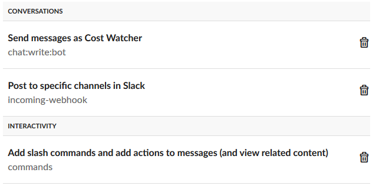

# AWS Cost Watcher

Provides a daily snapshot of all linked accounts' accumulative daily/monthly spend directly to your slack channel. This will help identify any accounts or services at risk to allow timely remediation to avoid that end of month bill shock.

## How it works
At a specified time, a lambda is run to provide the overall totals from cost explorer for each of your linked accounts

>*Note: as data is incrementally collected from linked accounts, the time this lambda runs may not include the full total for the day as is provided as an estimate*

To drill into a specified accounts details and provide a service breakdown, use the slash command in slack and provide an account number

`/detail 123456789012`

Service breakdown for the specified account will be fetched from cost explorer and posted to the slack channel as a private message

>*Note: spend indicator bars are customisable for both the overall account message and the detail messages based on your own spend thresholds*

## Architecture

## Cost Estimate
Runs free on the free tier.
Outside of the free tier, this service should cost very little to no $$ each month. This will vary depending on how many slash commands are run (API Gateway is 1c per request)

## Installation
>*Note: This needs to run from the master billing account to see all the linked accounts*

#### Slack App
1. Create a slack app [here](https://api.slack.com/apps?new_app=1)
2. Give the app a name and a workspace  

3. Settings\Basic Information > Display Information. Give the app a description, icon and background color  

4. Features\OAuth & Permissions > Scopes. Provide the following permissions  
  
   * Conversations\Send messages as &lt;app&gt;
   * Conversations\Post to specific channels in Slack
   * Interactivity\Add slash commands and add actions to messages (and view related content)

5. Features\Slash Commands > Create New Command and add the following:  
  
>*Note: we will provide the correct Request URL from our cloudformation deployment*

6. Settings\Install App > Install App to Workspace. Select the channel you want these messages to be delivered to (Tip: Create a specific channel for them)  

7. Settings\Install App > Grab the webhook URL for our cloudformation template

#### Custom emoji indicators
8. In the Slack application, click the workspace name, Customize Slack
9. Add 3 custom emojis of your choice (or use the bars in the image folder)  
   * green_bar
   * red_bar
   * yellow_bar

#### Cloudformation Template
8. In the [deploy.sh](./deploy.sh) template, change `<Staging Bucket Name>` to the name of an S3 bucket  
   >*Note: this bucket needs to be a unique name*  
9. In the [deploy.sh](./deploy.sh) template, change `<Slack webhook>` to the url we copied at step 7  
10. You can also add additional overrides for the following parameters (if required)
    * AccountWarningLevel
    * AccountDangerLevel
    * DetailWarningLevel
    * DetailDangerLevel
    * NotificationTime
    >*Note: Refer to the cloudformation template for details on these parameters*

11. Execute [deploy.sh](./deploy.sh) to deploy the cloudformation template

12. Copy the cloudformation template output value for `ApiGatewayInvokeURL` and replace the dummy url we provided for the slack slash command `Request URL` at step 5
